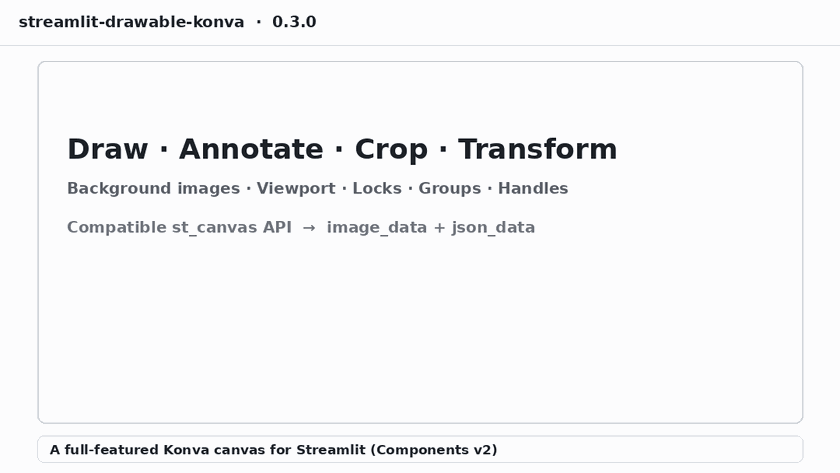

# Streamlit Drawable Konva



Streamlit custom component (Components **v2**) that provides a sketching canvas
using [Konva.js](https://konvajs.org/) / `react-konva`.

The public Python API is intentionally compatible with
[`streamlit-drawable-canvas-fix`](https://pypi.org/project/streamlit-drawable-canvas-fix/)
(`st_canvas` → `CanvasResult(image_data, json_data)`). Object JSON uses
Konva-oriented fields (`x`/`y`/`points`/…), not Fabric.js schemas.

## Features

- Freehand, line, rect, circle, point, polygon drawing
- **Rect crop** — single crop region with dimmed overlay (`rect_crop` mode)
- **Interaction locks & groups (0.3)** — per-object `locked`, `groupId`, axis `dragConstraint`, `transform_options`
- Transform mode (move / scale / rotate); double-click to delete
- **Viewport zoom, pan, and tilt** (display-only; see below)
- Background color or image
- Realtime or on-demand updates to Streamlit
- Undo / redo / clear toolbar
- Returns RGBA `image_data` and scene `json_data`

### Viewport: zoom / pan / tilt

Enabled by default (`enable_viewport_controls=True`). These change how the
canvas is **viewed**, not the stored object coordinates or exported
`image_data`.

| Control | How |
| --- | --- |
| Zoom | Mouse wheel, or toolbar **Zoom + / −** |
| Pan | `drawing_mode="pan"` and drag; or **Alt+drag**; or **middle-mouse drag** |
| Tilt | Toolbar **Tilt ↶ / ↷** (view rotation, ±15°) |
| Reset | Toolbar **Reset view** |

Try them in the demo page **Zoom / pan / tilt**.

## Why Konva.js (vs Fabric.js)?

Konva is not universally “better” than Fabric — both are mature 2D canvas
libraries. For **this** Streamlit component, Konva is the better fit.

| Concern | Konva | Fabric |
| --- | --- | --- |
| React integration | First-class via `react-konva` (declarative scene tree) | Imperative `fabric.Canvas`; React wrappers are thinner / more brittle |
| Mental model | Stage → Layer → Shape (clear export boundaries) | Single canvas object model; background vs drawing export needs extra care |
| Bundle / focus | Leaner, scene-graph oriented | Heavier; strong textile/image-editing heritage |
| Transforms | Built-in `Transformer` for select / scale / rotate | Excellent selection UX; historically the gold standard for editors |
| Ecosystem | Strong for interactive UIs and annotation tools | Huge installed base; many Fabric JSON examples in the wild |

**Why we chose Konva here**

1. **React + Streamlit Components v2** — the official CCv2 React template maps
   cleanly onto `react-konva`. Drawing state stays in React; updates go out via
   `setStateValue` without fighting an imperative canvas singleton.
2. **Layered export** — background images can live on a non-exported layer while
   strokes/shapes export cleanly to `image_data`, matching the upstream
   “background is not round-tripped” behavior with less glue code.
3. **Maintainability** — freerdraw / shapes / polygon / transform are ordinary
   React event handlers and Konva nodes, which is easier to evolve next to a
   modern Vite + TypeScript frontend than a Fabric-centric CRA-era stack.
4. **Performance for annotation UIs** — Konva’s layer/stage model scales well for
   ROI / sketching workloads typical in Streamlit apps.

**When Fabric may still win**

- You need **byte-compatible Fabric JSON** (existing pipelines, demos, or
  tutorials that assume `left`/`top`/`path` Fabric schemas).
- You want Fabric’s mature free-transform / skew / complex text editing out of
  the box without reimplementing edge cases.

This package keeps a **compatible Python API** (`st_canvas` → `CanvasResult`) so
apps can migrate from `streamlit-drawable-canvas-fix`, while accepting that
`json_data` is Konva-oriented rather than a Fabric dump.

## Install (uv)

```bash
uv sync
```

Build the frontend once (required before first Streamlit run):

```bash
cd streamlit_drawable_konva/frontend
npm install
npm run build
cd ../../
```

Editable install is handled by `uv sync` via the local `pyproject.toml`.

## Demo

```bash
uv run streamlit run app.py
```

## Development

CCv2 watches a production-style build into `frontend/build` (no separate webpack
dev server URL). Use two terminals:

**Terminal A — frontend watch build**

```bash
cd streamlit_drawable_konva/frontend
npm install
npm run dev
```

**Terminal B — Streamlit**

```bash
uv sync
uv run streamlit run app.py
```

Refresh the browser after frontend rebuilds.

## API

```python
from streamlit_drawable_konva import st_canvas

result = st_canvas(
    fill_color="rgba(255, 165, 0, 0.3)",
    stroke_width=3,
    stroke_color="#000000",
    background_color="#eee",
    background_image=None,
    update_streamlit=True,
    height=400,
    width=600,
    drawing_mode="freedraw",  # freedraw|line|rect|rect_crop|circle|point|polygon|transform|pan
    initial_drawing=None,
    display_toolbar=True,
    point_display_radius=3,
    enable_viewport_controls=True,
    key="canvas",
)

# result.image_data -> np.ndarray | None
# result.json_data  -> dict | None
```

### Crop controls (`rect_crop`)

- Draw one rectangle; a new draw replaces the previous crop
- Drag the box or use handles to move / resize
- Double-click the crop box to remove it
- Read coordinates with `crop_box_from_json(result.json_data)` → `(x, y, width, height)`
- Crop overlay is excluded from exported `image_data`

### Interaction locks, groups, handles (0.3)

Object fields (in `initial_drawing` / `json_data`):

- `locked: true` — visible, not interactive in transform mode
- `groupId` + optional `type: "group"` descriptor — move/rotate together
- `dragConstraint: { type: "axis", axis: {x, y}, min, max }` — constrained handle drag
- Per-object: `draggable`, `selectable`, `scalable`, `rotatable`, `deletable`

Python kwarg:

```python
st_canvas(..., transform_options={"allow_scale": False})
```

### Polygon controls

- Left-click: add point
- Right-click: close polygon
- Double-click: remove latest point

### Transform controls

- Click object to select
- Drag / resize / rotate with the transformer
- Double-click selected object to delete

### Viewport controls

- Wheel / **Zoom ±**: zoom toward cursor (wheel) or canvas center (buttons)
- **Pan** mode / Alt-drag / middle-mouse: move the view
- **Tilt ↶↷**: rotate the view
- **Reset view**: 100% zoom, 0° tilt, centered pan

## Migrating from Fabric drawable canvas

See [`MIGRATION.md`](MIGRATION.md) for import renames, JSON field mapping, and
behavioral differences vs `streamlit-drawable-canvas` / `-fix`.

## Packaging notes

- Registered as `streamlit-drawable-konva.st_canvas` via the in-package
  `streamlit_drawable_konva/pyproject.toml` manifest (`asset_dir = frontend/build`).
- Requires Streamlit `>= 1.51` (Components v2).
- Frontend toolchain targets Node `>= 18` (Vite 5).

## Publishing (GitHub / PyPI / Streamlit Cloud / gallery)

Step-by-step instructions: [`PUBLISHING.md`](PUBLISHING.md) (includes **updating**
GitHub / PyPI / Streamlit Cloud / gallery after the first release).

Current version: **0.3.0**.

Order: push to GitHub → publish to PyPI → deploy `app.py` on Community Cloud →
submit [`gallery/streamlit-drawable-konva.json`](gallery/streamlit-drawable-konva.json)
as a PR to [streamlit/gallery](https://github.com/streamlit/gallery/tree/main/components/registry).

## License

MIT
